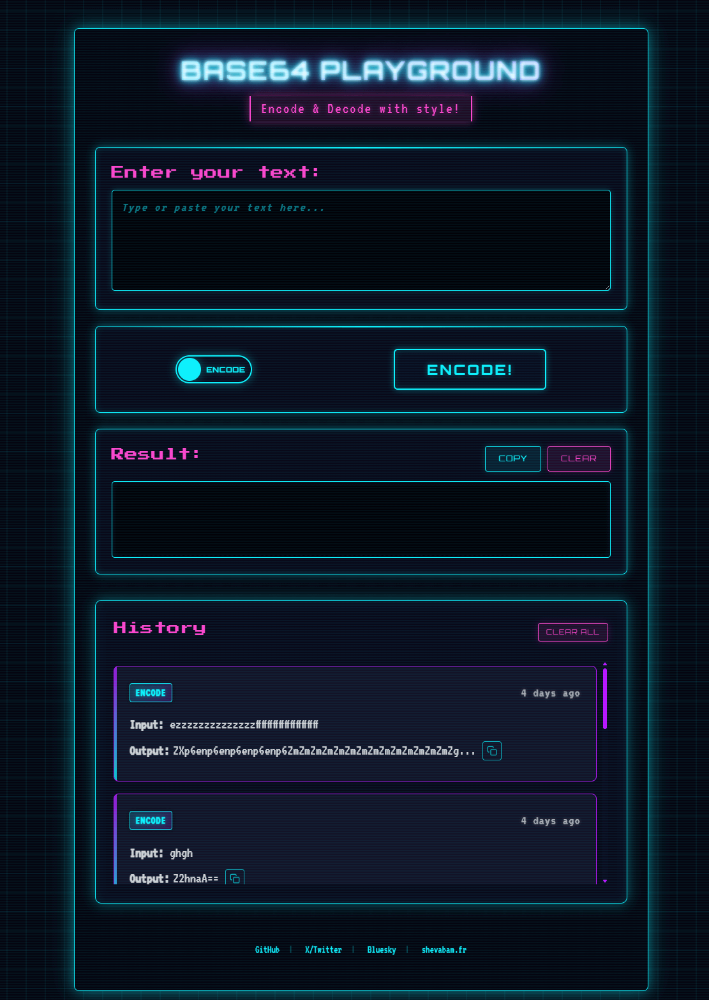

# Base64 Playground

A sleek, interactive web application for encoding and decoding Base64 strings with a cyberpunk-inspired interface.

## Features

- **Real-time Encoding/Decoding**: Instantly convert between plain text and Base64
- **History**: Keep track of your recent conversions
- **Responsive Design**: Works on desktop and mobile devices
- **Modern UI**: Cyberpunk-themed interface with smooth animations
- **Copy to Clipboard**: One-click copy functionality

## Live Demo

Check out the live demo at: [base64playground.xyz](https://base64playground.xyz)

## Development

### Available Scripts

- `npm run build` - Build the production files (minified JS and CSS)
  - `npm run minify:js` - Minify JavaScript files
  - `npm run minify:css` - Minify CSS files
- `npm run watch` - Watch for changes in source files and automatically rebuild

## Author

Created by [@shevabam](https://github.com/shevabam)

- [X](https://x.com/shevabam)
- [Bluesky](https://bsky.app/profile/shevabam.bsky.social)
- [Mastodon](https://mastodon.social/web/@shevabam)
- [Projects](https://shevabam.fr)

Feel free to [buy me a pizza 🍕](https://buymeacoffee.com/shevabam)!

